# Data Science Part A Practical Exam

**Author:** Anya Nash  
**Student number:** 25051911  
**Date:** 19 June 2026

------------------------------------------------------------------------

## Purpose and Structure

The purpose of this README document is to explain my reasoning and
process for answering each question (and sub question) in the Data
Science 871 Part A Practical Exam. The raw data from the
‘PracData26Folder’ is stored in the Project’s main data folder, while
any intermediary, cleaned or question-specific sub sample data is stored
in each question’s data folder. General code is stored in the Project’s
main code folder and any question-specific code is stored in each
question’s code folder. The relevant output for each question, such as
PowerPoints, pdfs, etc. is stored in each question’s folder.

### Getting Started

I used the following code to create my project and folder structures:

## Question 1: Coffee Hub

I used an R Markdown file to create my PowerPoint presentation. I
struggled a bit initially with the formatting, but AI helped me with
some of the finer syntax details.

    ## # A tibble: 6 × 13
    ##   name          roaster roast loc_country origin_1 origin_2 Cost_Per_100g Rating
    ##   <chr>         <chr>   <chr> <chr>       <chr>    <chr>            <dbl>  <dbl>
    ## 1 “Sweety” Esp… A.R.C.  Medi… Hong Kong   Panama   Ethiopia         14.3      95
    ## 2 Flora Blend … A.R.C.  Medi… Hong Kong   Africa   Asia Pa…          9.05     94
    ## 3 Ethiopia Sha… Revel … Medi… United Sta… Guji Zo… Souther…          4.7      92
    ## 4 Ethiopia Suk… Roast … Medi… United Sta… Guji Zo… Oromia …          4.19     92
    ## 5 Ethiopia Ged… Big Cr… Medi… United Sta… Gedeb D… Gedeo Z…          4.85     94
    ## 6 Ethiopia Kay… Red Ro… Light United Sta… Odo Sha… Guji Zo…          5.14     93
    ## # ℹ 5 more variables: review_date <chr>, desc_1 <chr>, desc_2 <chr>,
    ## #   desc_3 <chr>, Value_Score <dbl>

### Summary Statistics

I start with reporting some summary statistics:

-   Average cost per 100g by roast type
-   Average rating by roast type
-   Average cost per 100g by country
-   Average rating by country
-   Number of roasters by roast type
-   Cost and rating of coffee roasts

#### Average Cost Per 100g by Roast Type

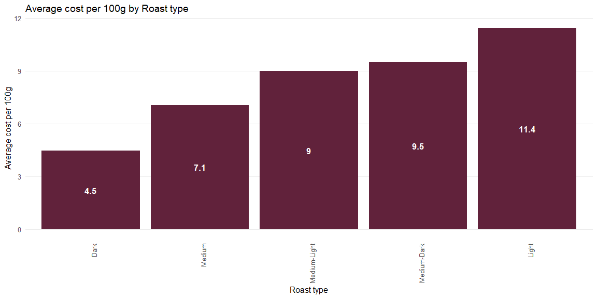

#### Average Rating by Roast Type

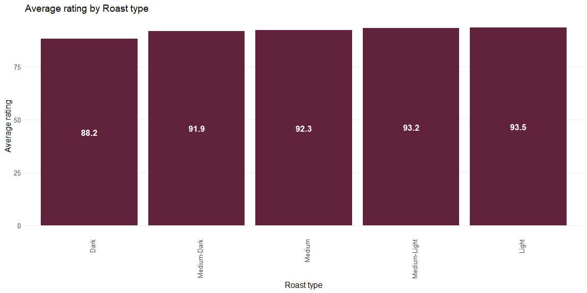

#### Average Cost Per 100g by Country

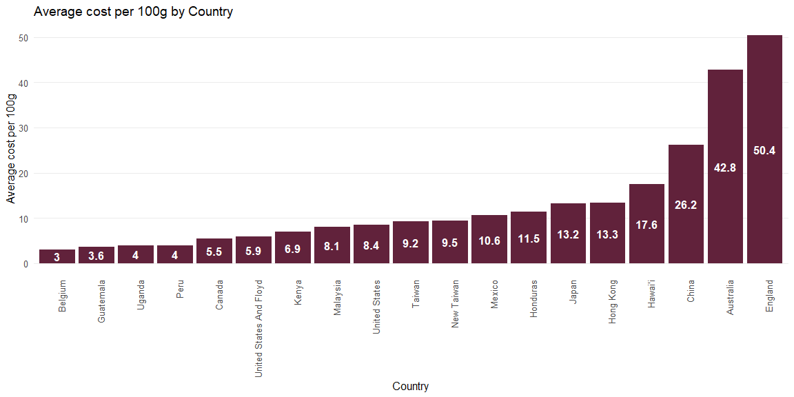

#### Average Rating by Country

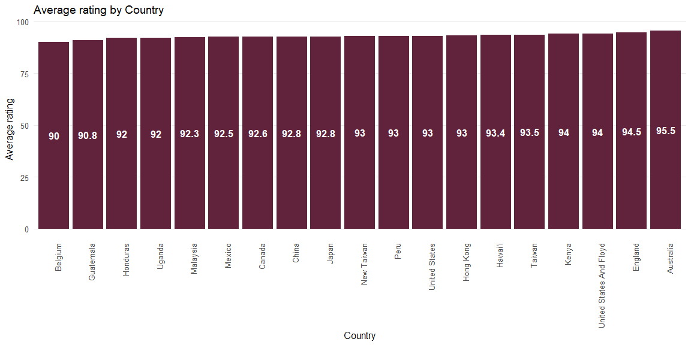

#### Number of Roasters by Roast Type

It took SO many trials and errors to eventually get the layout somewhat
acceptable for a slide (then I had some fun with the colours).

<table data-quarto-disable-processing='true' class='cl-d9ce2bae'><thead><tr style="overflow-wrap:break-word;"><th class="cl-d9c8f1e8">
Roast
</th><th class="cl-d9c8f1fc">
No_of_Roasters
</th></tr></thead><tbody><tr style="overflow-wrap:break-word;"><td class="cl-d9c8f1fd">
Medium-Light
</td><td class="cl-d9c8f206">
327
</td></tr><tr style="overflow-wrap:break-word;"><td class="cl-d9c8f207">
Medium
</td><td class="cl-d9c8f208">
136
</td></tr><tr style="overflow-wrap:break-word;"><td class="cl-d9c8f207">
Light
</td><td class="cl-d9c8f208">
119
</td></tr><tr style="overflow-wrap:break-word;"><td class="cl-d9c8f207">
Medium-Dark
</td><td class="cl-d9c8f208">
27
</td></tr><tr style="overflow-wrap:break-word;"><td class="cl-d9c8f210">
Dark
</td><td class="cl-d9c8f211">
3
</td></tr></tbody></table>

#### Cost and Rating of Coffee Roasts

I thought this scatter plot would be more informative than it actually
is, but it showed some interesting information regaarding the range/
spread of rating and cost.

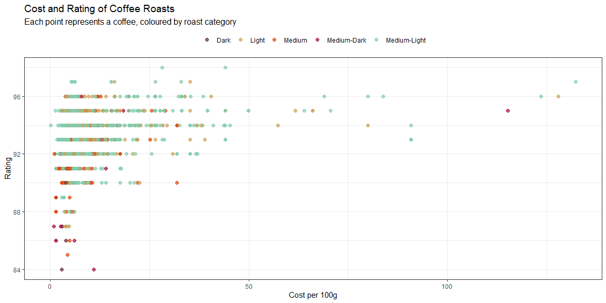

### Identifying the best coffee

Again, it took a while to eventually get the tables to fit on the slides
(and I still never managed to get them to centre properly on the
slides).

I then start identifying the best coffees using various methods. There
are a number of different ways that I can approach this:

1.  Cheapest coffee available
2.  Highest ranking coffee available
3.  Best price-ranking combination (best value)
4.  Best price-ranking (value) combination of three different types of
    roasts
5.  Best price-ranking (value) combination of three different types of
    roasts, where all the roasts are from the same country (in case
    there are advantages to getting all three roasts from the same
    country - import/ bulk ordering benefits??)

#### Cheapest Roast by Roast Type

<table data-quarto-disable-processing='true' class='cl-da4be134'><thead><tr style="overflow-wrap:break-word;"><th class="cl-da45db22">
Roast
</th><th class="cl-da45db36">
Cost
</th><th class="cl-da45db40">
Rating
</th><th class="cl-da45db41">
Value
</th><th class="cl-da45db4a">
Name
</th><th class="cl-da45db4b">
Roaster
</th></tr></thead><tbody><tr style="overflow-wrap:break-word;"><td class="cl-da45db54">
Dark
</td><td class="cl-da45db55">
2.93
</td><td class="cl-da45db56">
84
</td><td class="cl-da45db5e">
28.67
</td><td class="cl-da45db68">
Pike’s Place Blend
</td><td class="cl-da45db69">
Starbucks Coffee
</td></tr><tr style="overflow-wrap:break-word;"><td class="cl-da45db72">
Light
</td><td class="cl-da45db73">
3.39
</td><td class="cl-da45db7c">
95
</td><td class="cl-da45db7d">
28.02
</td><td class="cl-da45db86">
Panama La Mula Geisha Washed
</td><td class="cl-da45db87">
GK Coffee
</td></tr><tr style="overflow-wrap:break-word;"><td class="cl-da45db72">
Medium
</td><td class="cl-da45db73">
1.13
</td><td class="cl-da45db7c">
92
</td><td class="cl-da45db7d">
81.42
</td><td class="cl-da45db86">
Espresso Blend
</td><td class="cl-da45db87">
Ba Yang Coffee
</td></tr><tr style="overflow-wrap:break-word;"><td class="cl-da45db72">
Medium-Dark
</td><td class="cl-da45db73">
0.99
</td><td class="cl-da45db7c">
87
</td><td class="cl-da45db7d">
87.88
</td><td class="cl-da45db86">
100% Guatemalan
</td><td class="cl-da45db87">
Hill's Bros. Coffee
</td></tr><tr style="overflow-wrap:break-word;"><td class="cl-da45db88">
Medium-Light
</td><td class="cl-da45db90">
0.17
</td><td class="cl-da45db9a">
94
</td><td class="cl-da45db9b">
552.94
</td><td class="cl-da45db9c">
Karen J Kona Red Bourbon
</td><td class="cl-da45dba4">
Hula Daddy Kona Coffee
</td></tr></tbody></table>

#### Highest Rated Roast by Roast Type

<table data-quarto-disable-processing='true' class='cl-da8a59fa'><thead><tr style="overflow-wrap:break-word;"><th class="cl-da872fc8">
Roast
</th><th class="cl-da872fc9">
Cost
</th><th class="cl-da872fd2">
Rating
</th><th class="cl-da872fd3">
Value
</th><th class="cl-da872fdc">
Name
</th><th class="cl-da872fdd">
Roaster
</th></tr></thead><tbody><tr style="overflow-wrap:break-word;"><td class="cl-da872fde">
Dark
</td><td class="cl-da872fe6">
8.50
</td><td class="cl-da872fe7">
94
</td><td class="cl-da872ff0">
11.06
</td><td class="cl-da872ffa">
Indonesia Sumatra Gayo Espresso
</td><td class="cl-da872ffb">
Simon Hsieh's Aroma Roast Coffees
</td></tr><tr style="overflow-wrap:break-word;"><td class="cl-da872ffc">
Light
</td><td class="cl-da873004">
16.15
</td><td class="cl-da873005">
97
</td><td class="cl-da873006">
6.01
</td><td class="cl-da87300e">
Testi Ayla Double Ethiopia
</td><td class="cl-da87300f">
Barrington Coffee Roasting
</td></tr><tr style="overflow-wrap:break-word;"><td class="cl-da872ffc">
Medium
</td><td class="cl-da873004">
19.82
</td><td class="cl-da873005">
96
</td><td class="cl-da873006">
4.84
</td><td class="cl-da87300e">
Kona Mocca®
</td><td class="cl-da87300f">
Hula Daddy Kona Coffee
</td></tr><tr style="overflow-wrap:break-word;"><td class="cl-da872ffc">
Medium-Dark
</td><td class="cl-da873004">
7.79
</td><td class="cl-da873005">
96
</td><td class="cl-da873006">
12.32
</td><td class="cl-da87300e">
Bull Demon King
</td><td class="cl-da87300f">
Simon Hsieh Aroma Roast Coffees
</td></tr><tr style="overflow-wrap:break-word;"><td class="cl-da873010">
Medium-Light
</td><td class="cl-da873011">
28.27
</td><td class="cl-da873018">
98
</td><td class="cl-da873019">
3.47
</td><td class="cl-da87301a">
GW01 Finca Sophia Olympus Geisha
</td><td class="cl-da873022">
GK Coffee
</td></tr></tbody></table>

#### Best Valued Roast by Roast Type

<table data-quarto-disable-processing='true' class='cl-dab74af0'><thead><tr style="overflow-wrap:break-word;"><th class="cl-dab200c2">
Roast
</th><th class="cl-dab200cc">
Cost
</th><th class="cl-dab200d6">
Rating
</th><th class="cl-dab200d7">
Value
</th><th class="cl-dab200d8">
Name
</th><th class="cl-dab200d9">
Roaster
</th></tr></thead><tbody><tr style="overflow-wrap:break-word;"><td class="cl-dab200da">
Dark
</td><td class="cl-dab200e0">
2.93
</td><td class="cl-dab200ea">
84
</td><td class="cl-dab200eb">
28.67
</td><td class="cl-dab200ec">
Pike’s Place Blend
</td><td class="cl-dab200f4">
Starbucks Coffee
</td></tr><tr style="overflow-wrap:break-word;"><td class="cl-dab200f5">
Light
</td><td class="cl-dab200fe">
3.39
</td><td class="cl-dab200ff">
95
</td><td class="cl-dab20108">
28.02
</td><td class="cl-dab20109">
Panama La Mula Geisha Washed
</td><td class="cl-dab2010a">
GK Coffee
</td></tr><tr style="overflow-wrap:break-word;"><td class="cl-dab200f5">
Medium
</td><td class="cl-dab200fe">
1.13
</td><td class="cl-dab200ff">
92
</td><td class="cl-dab20108">
81.42
</td><td class="cl-dab20109">
Espresso Blend
</td><td class="cl-dab2010a">
Ba Yang Coffee
</td></tr><tr style="overflow-wrap:break-word;"><td class="cl-dab200f5">
Medium-Dark
</td><td class="cl-dab200fe">
0.99
</td><td class="cl-dab200ff">
87
</td><td class="cl-dab20108">
87.88
</td><td class="cl-dab20109">
100% Guatemalan
</td><td class="cl-dab2010a">
Hill's Bros. Coffee
</td></tr><tr style="overflow-wrap:break-word;"><td class="cl-dab20112">
Medium-Light
</td><td class="cl-dab20113">
0.17
</td><td class="cl-dab20114">
94
</td><td class="cl-dab2011c">
552.94
</td><td class="cl-dab2011d">
Karen J Kona Red Bourbon
</td><td class="cl-dab20126">
Hula Daddy Kona Coffee
</td></tr></tbody></table>

#### Best Valued Combination for Each Three-Roast Combination

<table data-quarto-disable-processing='true' class='cl-db21f7a6'><thead><tr style="overflow-wrap:break-word;"><th class="cl-db1be7c6">
Roast_Combo
</th><th class="cl-db1be7d0">
Avg_Value
</th><th class="cl-db1be7da">
Coffee_1
</th><th class="cl-db1be7da">
Coffee_2
</th><th class="cl-db1be7e4">
Coffee_3
</th></tr></thead><tbody><tr style="overflow-wrap:break-word;"><td class="cl-db1be7e5">
M + MD + ML
</td><td class="cl-db1be7ee">
240.75
</td><td class="cl-db1be7ef">
Espresso Blend
</td><td class="cl-db1be7ef">
100% Guatemalan
</td><td class="cl-db1be7f8">
Karen J Kona Red Bourbon
</td></tr><tr style="overflow-wrap:break-word;"><td class="cl-db1be7f9">
D + MD + ML
</td><td class="cl-db1be802">
223.16
</td><td class="cl-db1be80c">
Pike’s Place Blend
</td><td class="cl-db1be80c">
100% Guatemalan
</td><td class="cl-db1be80d">
Karen J Kona Red Bourbon
</td></tr><tr style="overflow-wrap:break-word;"><td class="cl-db1be7f9">
L + MD + ML
</td><td class="cl-db1be802">
222.95
</td><td class="cl-db1be80c">
Panama La Mula Geisha Washed
</td><td class="cl-db1be80c">
100% Guatemalan
</td><td class="cl-db1be80d">
Karen J Kona Red Bourbon
</td></tr><tr style="overflow-wrap:break-word;"><td class="cl-db1be7f9">
D + M + ML
</td><td class="cl-db1be802">
221.01
</td><td class="cl-db1be80c">
Pike’s Place Blend
</td><td class="cl-db1be80c">
Espresso Blend
</td><td class="cl-db1be80d">
Karen J Kona Red Bourbon
</td></tr><tr style="overflow-wrap:break-word;"><td class="cl-db1be7f9">
L + M + ML
</td><td class="cl-db1be802">
220.79
</td><td class="cl-db1be80c">
Panama La Mula Geisha Washed
</td><td class="cl-db1be80c">
Espresso Blend
</td><td class="cl-db1be80d">
Karen J Kona Red Bourbon
</td></tr><tr style="overflow-wrap:break-word;"><td class="cl-db1be7f9">
D + L + ML
</td><td class="cl-db1be802">
203.21
</td><td class="cl-db1be80c">
Pike’s Place Blend
</td><td class="cl-db1be80c">
Panama La Mula Geisha Washed
</td><td class="cl-db1be80d">
Karen J Kona Red Bourbon
</td></tr><tr style="overflow-wrap:break-word;"><td class="cl-db1be7f9">
D + M + MD
</td><td class="cl-db1be802">
65.99
</td><td class="cl-db1be80c">
Pike’s Place Blend
</td><td class="cl-db1be80c">
Espresso Blend
</td><td class="cl-db1be80d">
100% Guatemalan
</td></tr><tr style="overflow-wrap:break-word;"><td class="cl-db1be7f9">
L + M + MD
</td><td class="cl-db1be802">
65.77
</td><td class="cl-db1be80c">
Panama La Mula Geisha Washed
</td><td class="cl-db1be80c">
Espresso Blend
</td><td class="cl-db1be80d">
100% Guatemalan
</td></tr><tr style="overflow-wrap:break-word;"><td class="cl-db1be7f9">
D + L + MD
</td><td class="cl-db1be802">
48.19
</td><td class="cl-db1be80c">
Pike’s Place Blend
</td><td class="cl-db1be80c">
Panama La Mula Geisha Washed
</td><td class="cl-db1be80d">
100% Guatemalan
</td></tr><tr style="overflow-wrap:break-word;"><td class="cl-db1be816">
D + L + M
</td><td class="cl-db1be817">
46.04
</td><td class="cl-db1be820">
Pike’s Place Blend
</td><td class="cl-db1be820">
Panama La Mula Geisha Washed
</td><td class="cl-db1be82a">
Espresso Blend
</td></tr></tbody></table>

#### Best Valued Combination for Each Same-Country Three-Roast Combination

<table data-quarto-disable-processing='true' class='cl-de86bad0'><thead><tr style="overflow-wrap:break-word;"><th class="cl-de823848">
Roast_Combo
</th><th class="cl-de82385c">
Country
</th><th class="cl-de823866">
Avg_Value
</th><th class="cl-de823867">
Coffee_1
</th><th class="cl-de823868">
Coffee_2
</th><th class="cl-de823869">
Coffee_3
</th></tr></thead><tbody><tr style="overflow-wrap:break-word;"><td class="cl-de823870">
L + M + ML
</td><td class="cl-de823871">
Hawai'i
</td><td class="cl-de82387a">
197.04
</td><td class="cl-de82387b">
Ethiopia Yirgacheffe G1
</td><td class="cl-de82387c">
Medium-Dark Roast
</td><td class="cl-de823884">
Karen J Kona Red Bourbon
</td></tr><tr style="overflow-wrap:break-word;"><td class="cl-de823885">
L + MD + ML
</td><td class="cl-de823886">
Hawai'i
</td><td class="cl-de82388e">
195.66
</td><td class="cl-de82388f">
Ethiopia Yirgacheffe G1
</td><td class="cl-de823890">
CBD Coffee Dark Roast
</td><td class="cl-de823898">
Karen J Kona Red Bourbon
</td></tr><tr style="overflow-wrap:break-word;"><td class="cl-de823885">
M + MD + ML
</td><td class="cl-de823886">
Hawai'i
</td><td class="cl-de82388e">
190.78
</td><td class="cl-de82388f">
Medium-Dark Roast
</td><td class="cl-de823890">
CBD Coffee Dark Roast
</td><td class="cl-de823898">
Karen J Kona Red Bourbon
</td></tr><tr style="overflow-wrap:break-word;"><td class="cl-de823885">
D + M + MD
</td><td class="cl-de823886">
United States
</td><td class="cl-de82388e">
58.54
</td><td class="cl-de82388f">
Pike’s Place Blend
</td><td class="cl-de823890">
Colombia
</td><td class="cl-de823898">
100% Guatemalan
</td></tr><tr style="overflow-wrap:break-word;"><td class="cl-de823885">
L + M + MD
</td><td class="cl-de823886">
United States
</td><td class="cl-de82388e">
56.92
</td><td class="cl-de82388f">
Look for the Helpers
</td><td class="cl-de823890">
Colombia
</td><td class="cl-de823898">
100% Guatemalan
</td></tr><tr style="overflow-wrap:break-word;"><td class="cl-de823885">
D + M + ML
</td><td class="cl-de823886">
Taiwan
</td><td class="cl-de82388e">
54.11
</td><td class="cl-de82388f">
Indonesia Sumatra Gayo Espresso
</td><td class="cl-de823890">
Espresso Blend
</td><td class="cl-de823898">
Taiwan Natural Alishan Zhuo-Wu Geisha
</td></tr><tr style="overflow-wrap:break-word;"><td class="cl-de823885">
D + MD + ML
</td><td class="cl-de823886">
United States
</td><td class="cl-de82388e">
48.39
</td><td class="cl-de82388f">
Pike’s Place Blend
</td><td class="cl-de823890">
100% Guatemalan
</td><td class="cl-de823898">
Elida Natural ASD (Panama)
</td></tr><tr style="overflow-wrap:break-word;"><td class="cl-de823885">
D + L + MD
</td><td class="cl-de823886">
United States
</td><td class="cl-de82388e">
46.79
</td><td class="cl-de82388f">
Pike’s Place Blend
</td><td class="cl-de823890">
Look for the Helpers
</td><td class="cl-de823898">
100% Guatemalan
</td></tr><tr style="overflow-wrap:break-word;"><td class="cl-de823885">
D + L + M
</td><td class="cl-de823886">
Taiwan
</td><td class="cl-de82388e">
40.17
</td><td class="cl-de82388f">
Indonesia Sumatra Gayo Espresso
</td><td class="cl-de823890">
Panama La Mula Geisha Washed
</td><td class="cl-de823898">
Espresso Blend
</td></tr><tr style="overflow-wrap:break-word;"><td class="cl-de823899">
D + L + ML
</td><td class="cl-de8238a2">
Taiwan
</td><td class="cl-de8238a3">
36.31
</td><td class="cl-de8238ac">
Indonesia Sumatra Gayo Espresso
</td><td class="cl-de8238ad">
Panama La Mula Geisha Washed
</td><td class="cl-de8238ae">
Taiwan Natural Alishan Zhuo-Wu Geisha
</td></tr></tbody></table>

### Recommendations

Lastly, I finish with my recommendations based on my findings:

-   Recommendation 1: if just one type of coffee is to be stocked, I
    would recommend this coffee:

    -   Medium-Light roast: Karen J Kona Red Bourbon, roasted by Hula
        Daddy Kona Coffee
    -   It has the best value for money
    -   It is both inexpensive and highly rated

-   Recommendation 2: if the goal is to supply a range of coffee roasts,
    I would recommend the following combination:

    -   A medium roast: Espresso Blend
    -   A medium-dark roast: 100% Guatemalan
    -   And a medium-light roast: Karen J Kona Red Bourbon

-   Recommendation 3: if the goal is to supply a range of coffee roasts
    and there is an advantage from importing them all from the same
    country, I would recommend the following roasts from Hawai’i:

    -   Light roast: Ethiopia Yirgacheffe G1
    -   Medium roast: Medium-Dark Roast
    -   And medium-light roast: Karen J Kona Red Bourbon

I used a plot to create slide headings/ sections in my slide show

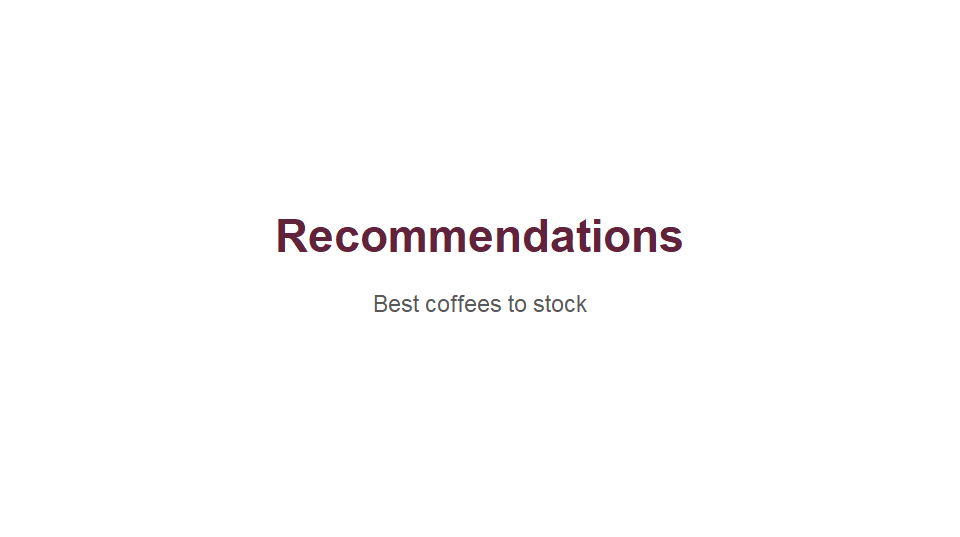

## Question 2: Baby Names

I first start by loading the data and the functions required for this
question.

### Spearman Correlation

After researching some additional context and meaning of the Spearman
Correlation, I calculate it between each year’s 25 most popular boys’
and girls’ names and that of the next 3 years. I plot it as 3 line
graphs, plotted separately for male names and female names.

#### Preparing the data and calculating the Spearman Correlation

#### Plotting the Spearman Correlation for female names

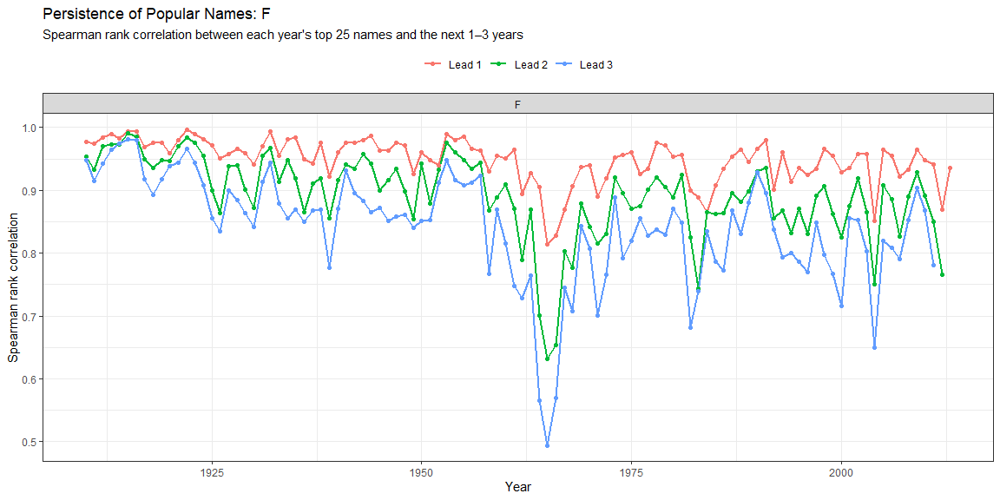

The graph shows that the top 25 female names are very persistent for the
time period analysed. For most of the years, the Spearman rank
correlation is between 0.8 and 1, except for between 1960 and 1970,
around 1985 and around 2005. Therefore, if a female name is in the top
25, then there is a very high probability that it will be in the top 25
in the following year as well as the year after that. According to this
graph, it appears that female names are no more or less likely to
persist since the 1990s compared to earlier years; the pattern does not
appear to change significantly from the 1990s.

#### Plotting the Spearman Correlation for male names

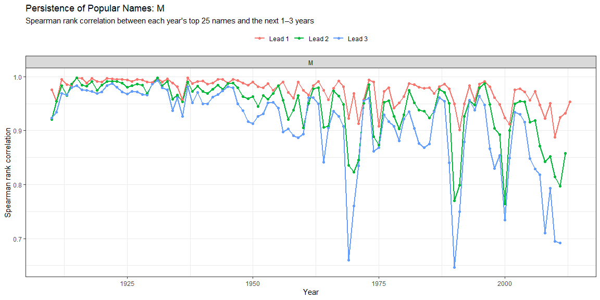

The graph shows that the top 25 male names are very persistent for the
time period analysed. Before 1965, the Spearman rank correlation remains
between 0.85 and 1, however, the range significantly increases and the
consistency decreases after 1965. This indicates that male names were
initially quite persistent, but that persistence has decreased
significantly since 1965. Therefore, the probability of a male name
remaining in the top 25 male names began very high, but in more recent
years, that probability has become smaller. From this graph, it appears
that male names are less persistent since the 1990s than prior to that -
popular names have become a bit slower to persist since the 1990s.

### Spearman Correlation by Decade

I now do the same thing as above, but this time calculate the Spearman
correlation for popular names by decade.

#### Spearman Correlation by Decade for Female Names

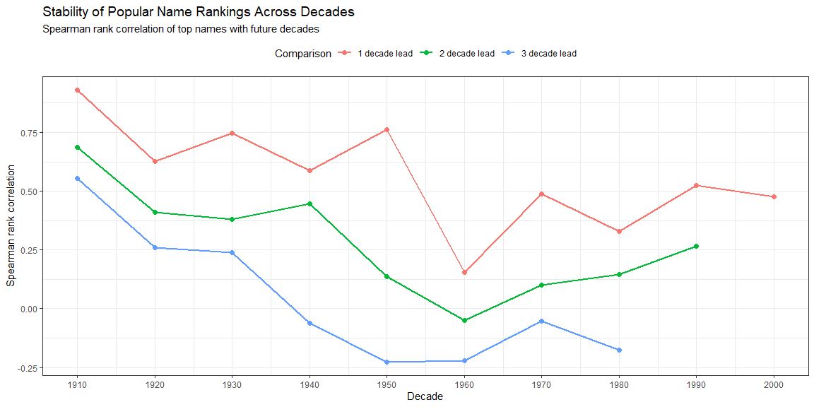

The same trends are apparent when looking at popular female names by
decade - according to this graph, it appears that female names are no
more or less likely to persist since the 1990s compared to earlier
years; the pattern does not appear to change significantly from the
1990s.

#### Spearman Correlation by Decade for Male Names

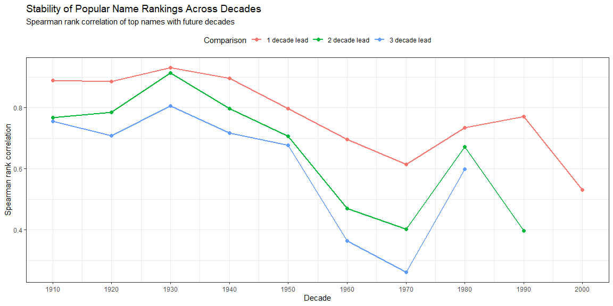

Once again, this graph shows similar trends to the yearly popular make
names graph above. From this graph, it appears that male names are less
persistent since the 1990s than prior to that - popular names have
become a bit slower to persist since the 1990s.

### Name Surges

I created a table showing the top 10 female names and top 10 male names
that had the largest year-to-year percentage rank improvement. I limited
the ranking to names that had more than 100 counts in the previous
period, so that large increases in relatively unpopular names are not
captured.

| Year | Gender | Name | Previous count | Current count | Change in count | % change in count | Previous rank | Current rank | Rank improvement |
|:---|:----|:------|:-------|:-------|:--------|:---------|:-------|:-------|:--------|
| 1976 | F | Jaime | 897 | 7836 | 6939 | 773.6 | 262 | 29 | 803.4483 |
| 1989 | F | Kiara | 171 | 2595 | 2424 | 1417.5 | 832 | 115 | 623.4783 |
| 2002 | F | Ashanti | 253 | 2927 | 2674 | 1056.9 | 784 | 115 | 581.7391 |
| 1957 | F | Tammy | 204 | 4363 | 4159 | 2038.7 | 602 | 107 | 462.6168 |
| 1979 | F | Brianne | 133 | 1655 | 1522 | 1144.4 | 813 | 168 | 383.9286 |
| 1995 | F | Alondra | 111 | 1149 | 1038 | 935.1 | 1121 | 242 | 363.2231 |
| 2007 | F | Miley | 141 | 1213 | 1072 | 760.3 | 1249 | 277 | 350.9025 |
| 1966 | F | Michelle | 16215 | 27152 | 10937 | 67.4 | 18 | 4 | 350.0000 |
| 1991 | F | Iesha | 253 | 1875 | 1622 | 641.1 | 703 | 157 | 347.7707 |
| 1982 | F | Kayla | 266 | 2268 | 2002 | 752.6 | 583 | 132 | 341.6667 |
| 2011 | M | Mason | 14831 | 19488 | 4657 | 31.4 | 12 | 2 | 500.0000 |
| 2013 | M | Jayceon | 128 | 1827 | 1699 | 1327.3 | 1059 | 208 | 409.1346 |
| 2010 | M | Bentley | 497 | 3762 | 3265 | 656.9 | 505 | 100 | 405.0000 |
| 1998 | M | Dawson | 141 | 1883 | 1742 | 1235.5 | 779 | 175 | 345.1429 |
| 2013 | M | Noah | 17302 | 18179 | 877 | 5.1 | 4 | 1 | 300.0000 |
| 1995 | M | Tristan | 441 | 3085 | 2644 | 599.5 | 454 | 121 | 275.2066 |
| 2013 | M | Jase | 1100 | 4539 | 3439 | 312.6 | 304 | 89 | 241.5730 |
| 2002 | M | Ethan | 17959 | 22105 | 4146 | 23.1 | 17 | 5 | 240.0000 |
| 1995 | M | Bailey | 112 | 990 | 878 | 783.9 | 853 | 273 | 212.4542 |
| 1972 | M | Christopher | 48251 | 52195 | 3944 | 8.2 | 6 | 2 | 200.0000 |

Top 10 year-on-year name surges by gender

#### Names Surge and TV Shows/ Movies

First, I merged the HBO_titles dataset with the HBO_credits dataset. I
then matched the character names to the national baby name dataset I
created earlier. I then plotted, of the top 25 male and female names,
the names that were also names of TV show or movie characters in a
bubble plot. In the bubble plot, the size of the bubbles represent the
number of babies with a particular name, while the size of the stars
indicate the tmdb popularity score of the TV show/ movie. The plots are
separate by gender and show the persistence and popularity of names, and
how said persistence and popularity interacts with TV show/ movie
character names.

##### Male Names

The plot below shows how the popularity and persistence of male names
interacts with character names of TV show or movie characters. The male
names chosen are the 20 male names that experienced the largest
percentage rank improvement. These names were then merged with character
names.

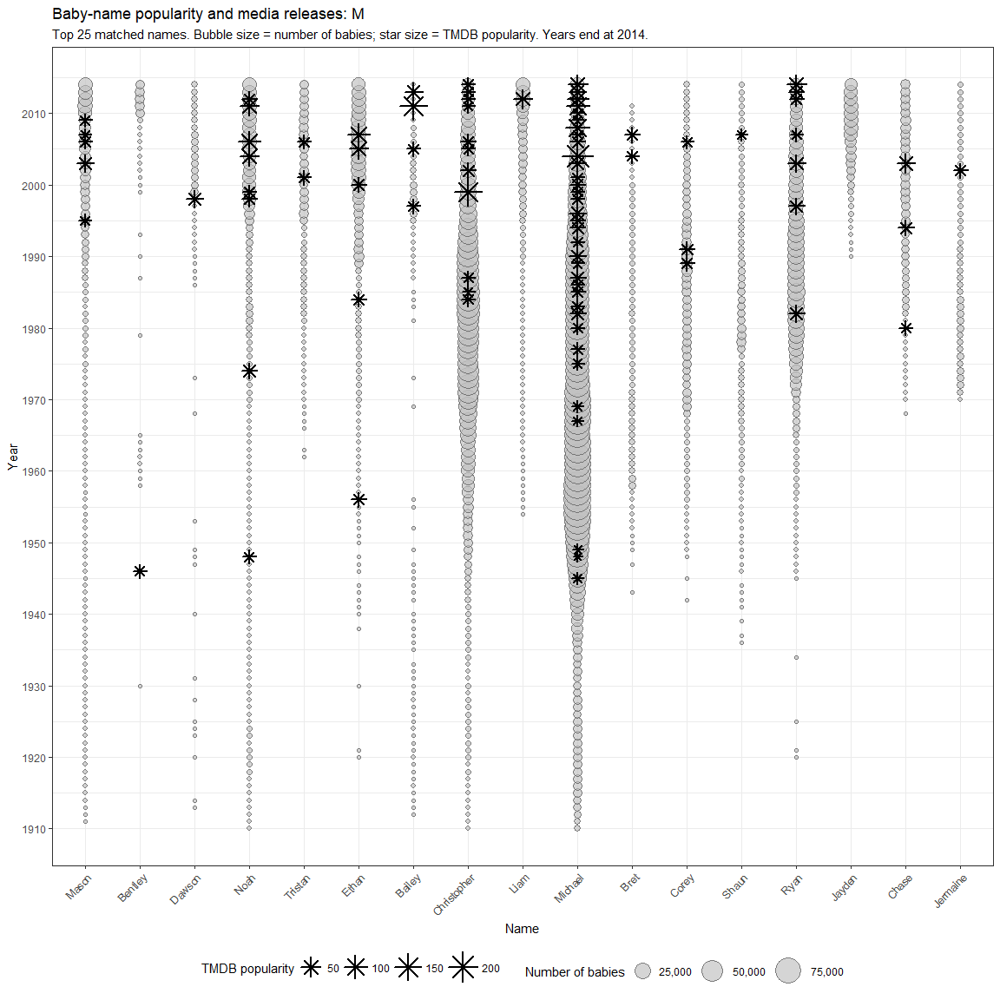

As seen from the plot above, there is not a clear pattern between the
popularity or persistence of names and character names from TV shows/
movies for these particular male names. However, it is interesting to
observe how these variables develop and interact over time. Also, for
most of these names, their popularity has been increasing over time.
This makes them an excellent choice for a toy company, because their
popularity is increasing, and increasing regardless of popular character
names. It is clear that some names are classics - Christopher, Michael
and Ryan remain persistently popular, regardless of whether TV show or
movie characters have these names. These names are also the names of
characters in many TV shows/ movies. Therefore, for a toy company, these
names are good to take note of, because they are unlikely to change
significantly in popularity over time, meaning they are a lower-risk
investment.

##### Female Names

The plot below shows how the popularity and persistence of female names
interacts with character names of TV show or movie characters. The
female names chosen are the 20 female names that experienced the largest
percentage rank improvement. These names were then merged with character
names.

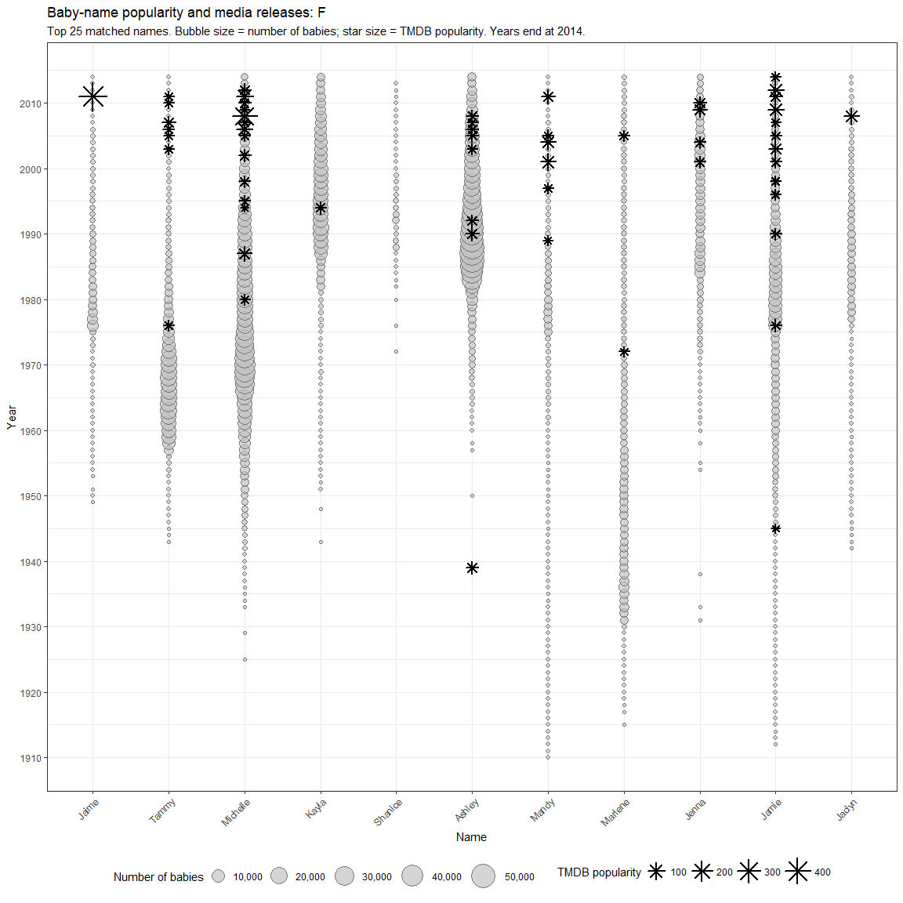

As seen from the plot above, there is not a clear pattern between the
popularity or persistence of names and character names from TV shows/
movies for these particular female names. However, it is interesting to
observe how these variables develop and interact over time. It is clear
that some names are classics - Michelle, Kayla, Ashley, Jenna and Jamie
remain persistently popular, regardless of whether TV show or movie
characters have these names. Therefore, for a toy company, these names
are good to take note of, because they are unlikely to change
significantly in popularity over time, meaning they are a lower-risk
investment.

## Question 3: Loans and Credit

Assist in understanding predictors of loan defaults and efficacy of
Lending Club’s customer grading system which used to predict whether
client would likely default on loans or not.

I first start by loading the data and the functions required for this
question.

### Cleaning data and defining who counts as default

Current and Fully Paid are treated as non-defaulter Charged off/
default/ late (31-120 days) treated as defaulters

### Default Profile Summary Statistics

#### Default Rate by Grade

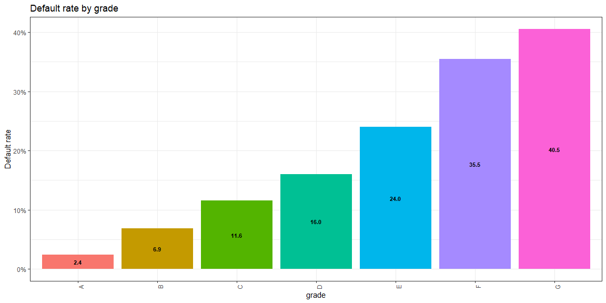

It is clear from the graph that as credit grade goes from A to G, the
default rate increases exponentially. Therefore, grade is highly
associated with the default rate (although that is how it is designed).

#### Default Rate by Term of Loan

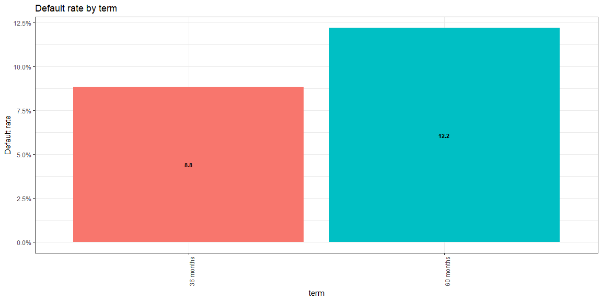

There is a small difference in the default rate based on the length of
the loan, with the longer loan having a slightly higher default rate.

#### Default Rate by Length of Employment

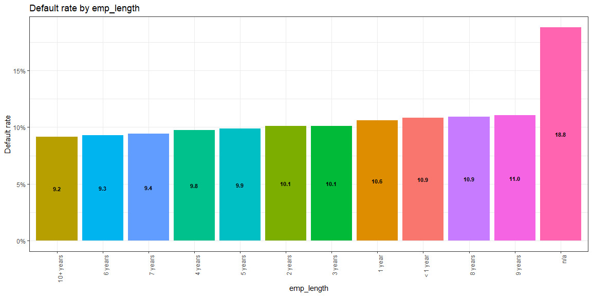

There is not a substantial difference in the default rate based on the
length of employment, except for those who have n/a for length of
employment - they have a much higher default rate. This is logical,
because those who answered n/a to length of employment are most likely
not working/ unemployed. Thus, they probably have a less stable income,
which would make their default rate higher.

#### Default Rate by State

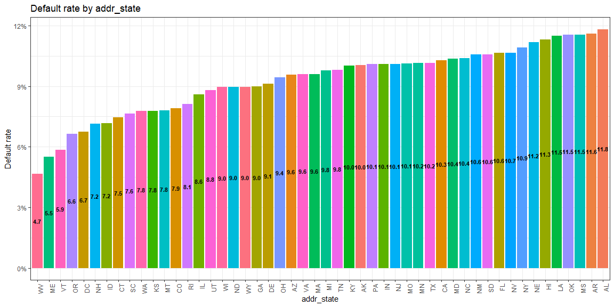

There is no obvious outlier in the default rate based on US state,
however, the difference in default rate between the state with the
highest default rate (Alabama) and the state with the lowest default
rate (West Virginia) is substantial. Texas has a default rate on the
higher side, however, it is not obviously different from any of the
other states.

#### Default Rate by State for Short Term Loans

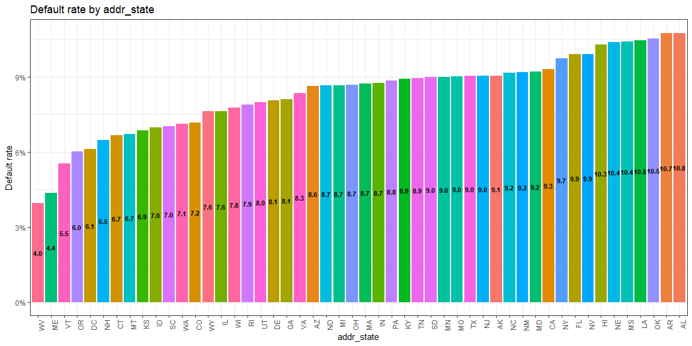

There is no obvious outlier in the default rate based on US state for
short term loans, however, the difference in default rate between the
state with the highest default rate (Alabama) and the state with the
lowest default rate (West Virginia) is substantial. Texas has a default
rate on the higher side, however, it is not obviously different from any
of the other states.

#### Default Rate by DTI Band

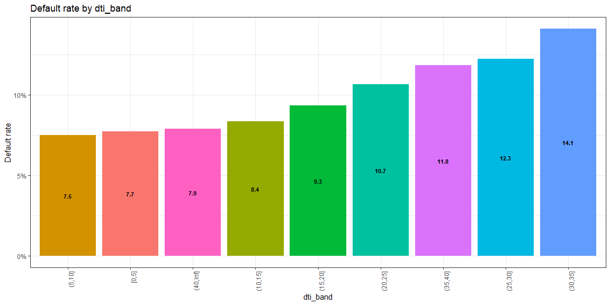

The default rate for different bands of the debt-to-income ratio follows
an expected pattern. The default rate is lower for a lower
debt-to-income ratio, and the default rate is higher for a higher
debt-to-income ratio.

#### Default Rate by Purpose of Loan

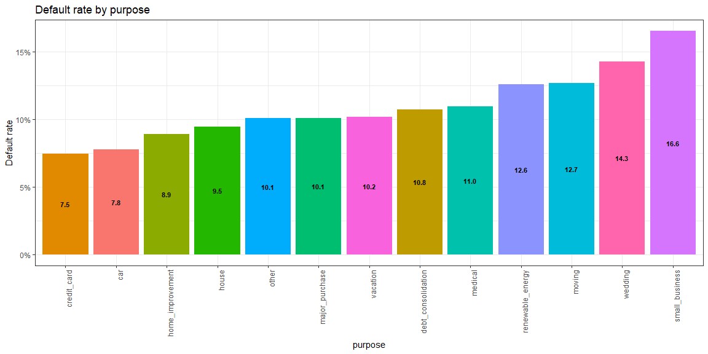

The default rate differs a bit based on the purpose of the loan. Loans
for paying off credit cards or buying cars have the lowest default rate,
while loans for weddings and small businesses have the highest default
rate. It is logical that loans for small businesses have the highest
default rate, since small businesses often carry a higher investment
risk, and have unpredictable profits (and often low/ no initial
profits).

### Default Rate, Credit Grades and Young Individuals

Unfortunately, there is no age variable in the data. Therefore, as a
very rough, imperfect proxy for age, I use length of employment. I
classify young individuals as those with a length of employment of 5
years or less. Then, to determine whether credit grades are a good
indicator for whether younger individuals will default on their loans, I
regress the default rate on credit grade, restricting the sample to
younger individuals only. The table below shows the results of the
regression.

    ## 
    ## Call:
    ## lm(formula = default ~ factor(grade), data = .)
    ## 
    ## Residuals:
    ##      Min       1Q   Median       3Q      Max 
    ## -0.41484 -0.12065 -0.07112 -0.02362  0.97638 
    ## 
    ## Coefficients:
    ##                Estimate Std. Error t value Pr(>|t|)    
    ## (Intercept)    0.023615   0.000980   24.10   <2e-16 ***
    ## factor(grade)B 0.047500   0.001285   36.97   <2e-16 ***
    ## factor(grade)C 0.097035   0.001296   74.88   <2e-16 ***
    ## factor(grade)D 0.141490   0.001556   90.91   <2e-16 ***
    ## factor(grade)E 0.221019   0.002235   98.89   <2e-16 ***
    ## factor(grade)F 0.331223   0.003942   84.02   <2e-16 ***
    ## factor(grade)G 0.391223   0.007566   51.71   <2e-16 ***
    ## ---
    ## Signif. codes:  0 '***' 0.001 '**' 0.01 '*' 0.05 '.' 0.1 ' ' 1
    ## 
    ## Residual standard error: 0.2954 on 427348 degrees of freedom
    ## Multiple R-squared:  0.04928,    Adjusted R-squared:  0.04927 
    ## F-statistic:  3692 on 6 and 427348 DF,  p-value: < 2.2e-16

<table class="table" style="color: black; width: auto !important; margin-left: auto; margin-right: auto;">
<caption>
Regression of default rate on loan grade
</caption>
<thead>
<tr>
<th style="text-align:left;">
Variable
</th>
<th style="text-align:right;">
Estimate
</th>
<th style="text-align:right;">
Std. Error
</th>
<th style="text-align:right;">
t-statistic
</th>
<th style="text-align:right;">
p-value
</th>
</tr>
</thead>
<tbody>
<tr>
<td style="text-align:left;">
Constant
</td>
<td style="text-align:right;">
0.024
</td>
<td style="text-align:right;">
0.001
</td>
<td style="text-align:right;">
24.097
</td>
<td style="text-align:right;">
0
</td>
</tr>
<tr>
<td style="text-align:left;">
Grade B
</td>
<td style="text-align:right;">
0.048
</td>
<td style="text-align:right;">
0.001
</td>
<td style="text-align:right;">
36.969
</td>
<td style="text-align:right;">
0
</td>
</tr>
<tr>
<td style="text-align:left;">
Grade C
</td>
<td style="text-align:right;">
0.097
</td>
<td style="text-align:right;">
0.001
</td>
<td style="text-align:right;">
74.878
</td>
<td style="text-align:right;">
0
</td>
</tr>
<tr>
<td style="text-align:left;">
Grade D
</td>
<td style="text-align:right;">
0.141
</td>
<td style="text-align:right;">
0.002
</td>
<td style="text-align:right;">
90.907
</td>
<td style="text-align:right;">
0
</td>
</tr>
<tr>
<td style="text-align:left;">
Grade E
</td>
<td style="text-align:right;">
0.221
</td>
<td style="text-align:right;">
0.002
</td>
<td style="text-align:right;">
98.887
</td>
<td style="text-align:right;">
0
</td>
</tr>
<tr>
<td style="text-align:left;">
Grade F
</td>
<td style="text-align:right;">
0.331
</td>
<td style="text-align:right;">
0.004
</td>
<td style="text-align:right;">
84.018
</td>
<td style="text-align:right;">
0
</td>
</tr>
<tr>
<td style="text-align:left;">
Grade G
</td>
<td style="text-align:right;">
0.391
</td>
<td style="text-align:right;">
0.008
</td>
<td style="text-align:right;">
51.708
</td>
<td style="text-align:right;">
0
</td>
</tr>
</tbody>
</table>

As seen in the regression table above, credit grade is a somewhat good
indicator of whether younger individuals will default. This is because
all the coefficients are statistically significant with an
economically-meaningful magnitude, however, the R-squared value is quite
low at 0.04928, meaning there are many other factors that influence the
default rate of young individuals.

### Interest Rates, Age, Occupation and Credit Scores

I created 11 different occupation groups. I used AI to get the initial
key words, then kept going back to the data to look for more to add. It
was a very time consuming process (and I definitely spent way too much
time on it).

Using employment length as an imperfect, rough proxy for age once again
and using very rough occupation categories, I regress interest rate on
employment length, occupation and credit score to determine whether
interest rates are determined by these factors. The results are
displayed below.

    ## OLS estimation, Dep. Var.: int_rate
    ## Observations: 786,940
    ## Fixed-effects: grade: 7,  emp_length: 12,  emp_title_clean: 43,388
    ## RMSE: 1.3155   Adj. R2: 0.926009

With an R-squared value of 0.926009, it is clear that interest rates are
strongly associated with age, occupation and credit scores.

### Risk Profiles

The table below shows the top 10 combinations of credit grade, DTI band,
purpose of loan and type of home ownership that have the highest default
rates.

| Grade | DTI band | Loan purpose | Home ownership | Number of borrowers | Default rate | Median annual income |
|:----:|:-----:|:-----------:|:---------:|:------------:|:--------:|:------------:|
| G | (30,35\] | debt_consolidation | RENT | 202 | 53.5% | $55,500 |
| G | (25,30\] | debt_consolidation | RENT | 159 | 46.5% | $56,000 |
| F | (30,35\] | debt_consolidation | RENT | 597 | 44.7% | $50,119 |
| F | (20,25\] | debt_consolidation | RENT | 716 | 43.7% | $60,000 |
| G | (30,35\] | debt_consolidation | MORTGAGE | 186 | 41.9% | $65,000 |
| F | (25,30\] | debt_consolidation | RENT | 685 | 41.8% | $55,000 |
| G | (20,25\] | debt_consolidation | RENT | 172 | 40.7% | $57,450 |
| F | (35,40\] | debt_consolidation | RENT | 295 | 40.0% | $50,000 |
| G | (15,20\] | debt_consolidation | RENT | 118 | 39.8% | $55,674 |
| F | (15,20\] | debt_consolidation | RENT | 628 | 39.5% | $62,000 |

Top 10 borrower profiles with the highest default rates

From the table above, we can see that the highest defaulters are
individuals with credit grades of either F or G, a DTI that is greater
than 25 and who rent their homes. The median income for each group is
between 50000 and 60000 US dollars.

When lenders assess borrower credibility, they can do a number of things
to reduce default risk. They can identify those borrowers who are part
of the highest default risk combination categories and either reduce the
loan amount to these borrowers, or have additional checks and balances
before approving the loan. Instead of just focusing on one category or
“tick-box” at a time, lenders now have a better, fuller picture of the
default risk of the borrower. A borderline answer for one or two
categories could be viewed as okay when each category is viewed in
isolation, but could paint a much riskier picture when categories are
viewed together.

### DTI Cap

The table below shows how the share of loans accepted and default rate
would change, if there was a DTI cap imposed.

<table class="table" style="color: black; width: auto !important; margin-left: auto; margin-right: auto;">
<caption>
Default risk under alternative DTI hard caps
</caption>
<thead>
<tr>
<th style="text-align:center;">
DTI cap
</th>
<th style="text-align:center;">
Borrowers accepted
</th>
<th style="text-align:center;">
Share accepted
</th>
<th style="text-align:center;">
Default rate
</th>
</tr>
</thead>
<tbody>
<tr>
<td style="text-align:center;">
5
</td>
<td style="text-align:center;">
47688
</td>
<td style="text-align:center;">
5.3%
</td>
<td style="text-align:center;">
7.7%
</td>
</tr>
<tr>
<td style="text-align:center;">
10
</td>
<td style="text-align:center;">
164287
</td>
<td style="text-align:center;">
18.1%
</td>
<td style="text-align:center;">
7.6%
</td>
</tr>
<tr>
<td style="text-align:center;">
15
</td>
<td style="text-align:center;">
341407
</td>
<td style="text-align:center;">
37.7%
</td>
<td style="text-align:center;">
8.0%
</td>
</tr>
<tr>
<td style="text-align:center;">
20
</td>
<td style="text-align:center;">
528833
</td>
<td style="text-align:center;">
58.4%
</td>
<td style="text-align:center;">
8.5%
</td>
</tr>
<tr>
<td style="text-align:center;">
25
</td>
<td style="text-align:center;">
684950
</td>
<td style="text-align:center;">
75.6%
</td>
<td style="text-align:center;">
9.0%
</td>
</tr>
<tr>
<td style="text-align:center;">
30
</td>
<td style="text-align:center;">
798324
</td>
<td style="text-align:center;">
88.1%
</td>
<td style="text-align:center;">
9.4%
</td>
</tr>
<tr>
<td style="text-align:center;">
35
</td>
<td style="text-align:center;">
864625
</td>
<td style="text-align:center;">
95.4%
</td>
<td style="text-align:center;">
9.8%
</td>
</tr>
<tr>
<td style="text-align:center;">
40
</td>
<td style="text-align:center;">
891675
</td>
<td style="text-align:center;">
98.4%
</td>
<td style="text-align:center;">
9.9%
</td>
</tr>
<tr>
<td style="text-align:center;">
45
</td>
<td style="text-align:center;">
896435
</td>
<td style="text-align:center;">
98.9%
</td>
<td style="text-align:center;">
9.9%
</td>
</tr>
<tr>
<td style="text-align:center;">
50
</td>
<td style="text-align:center;">
899763
</td>
<td style="text-align:center;">
99.3%
</td>
<td style="text-align:center;">
9.9%
</td>
</tr>
<tr>
<td style="text-align:center;">
55
</td>
<td style="text-align:center;">
901461
</td>
<td style="text-align:center;">
99.5%
</td>
<td style="text-align:center;">
9.9%
</td>
</tr>
</tbody>
</table>

As seen in the table above, as the DTI cap increases, both the share
accepted and default rate increase. Therefore, there is a trade-off
between the risk of default and maximising the number of borrowers. A
DTI cap that is too strict will cause the number of borrowers to decline
significantly, however, it would also have the positive effect of
reducing the default rate. The same goes for a DTI cap that is too
lenient - the number of borrowers will increase, but at the cost of the
default rate increasing as well. I think an appropriate hard-cap for DTI
levels is 25. At 25, approximately 75% of borrowers are accepted, which
is not too low, and the default rate is at 9%, which is an improvement
compared to no DTI cap.

## Question 4: Netflix

### Loading the data and functions

Separating content with multiple countries into multiple rows (long
format)

## Summary of the Top 10 Netflix Content-Producing Countries

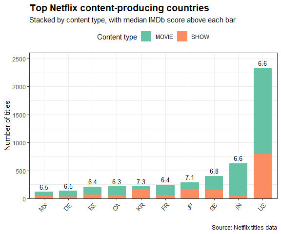

As seen in the graph above, the US produces by far the most content for
Netflix. The next two highest countries are India and Great Britain.

## Relationship Between Movie TMDB Score and Runtime

The scatter plot below shows the relationship between TMDB score and
runtime, by genre. As shown by the graph below, there is a very weak
relationship between TMDB score and runtime. Interestingly, though,
comedies, documentations and dramas have a somewhat similar TMDB score,
but the runtime for comedies and documentations is, on average, shorter
than the runtime of dramas. Romances and thrillers tend to have lower
scores than the aforementioned genres.

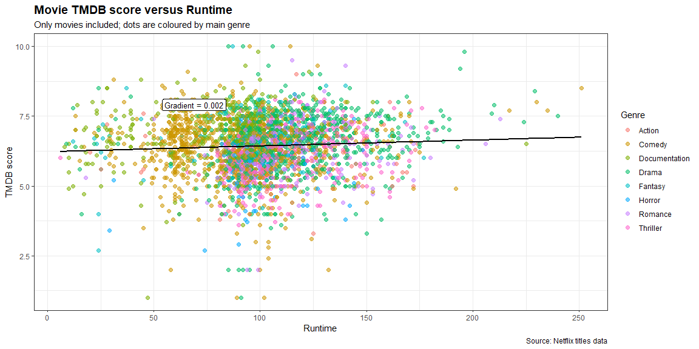

## Average TMDB Popularity of movies over time by genre and country

The graphs below plot the average TMDB popularity by genre and country
over time. The countries that produce the most Netflix movies are
plotted (individually) and only the top 6 genres per country are
included.

### US

As seen in the graph below, the top 6 genres for production in the US
are: comedy, drama, romance, documentation, horror and thriller. The
popularity of dramas and thrillers has increased exponentially since
2020. Therefore, it would be a good decision to focus on streaming
dramas and thrillers produced in the US.

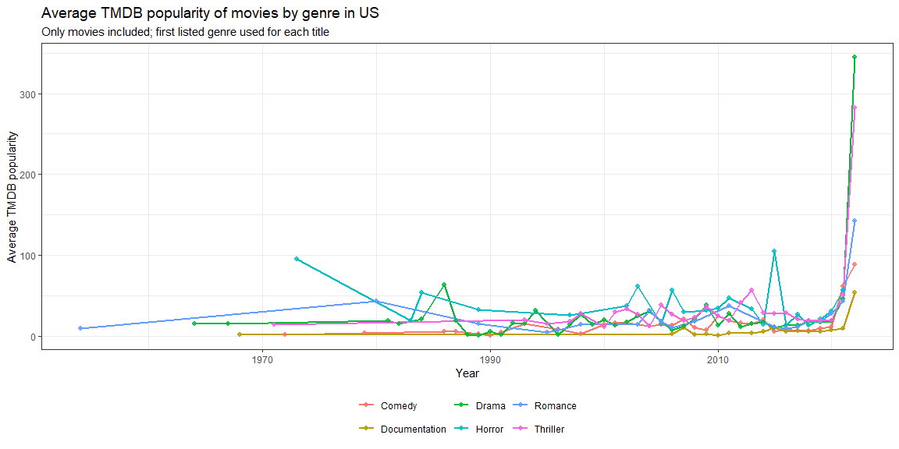

### India

As seen in the graph below, the top 6 genres for production in India
are: comedy, drama, romance, action, crime and thriller. The popularity
of actions and comedies has increased exponentially since the late
2010s. Therefore, it would be a good decision to focus on streaming
actions and comedies produced in India.

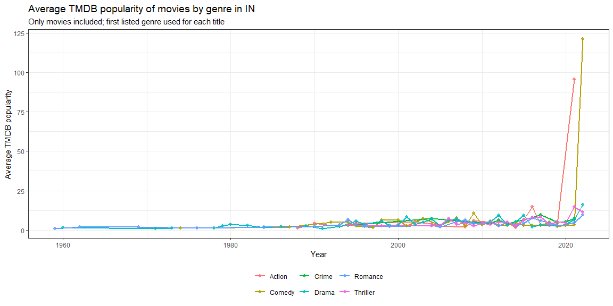

### Great Britain

As seen in the graph below, the top 6 genres for production in Great
Britain are: comedy, drama, romance, action, documentation and thriller.
The popularity of actions and documentations has increased slightly
since 2020. Therefore, it would be a good decision to focus on streaming
actions and documentations produced in Great Britain. I would be
hesitant to focus on streaming thrillers from Great Britain because,
despite increasing exponentially in 2020, their popularity appears to be
on a heavy downward trend, so it woud be a riskier investment.

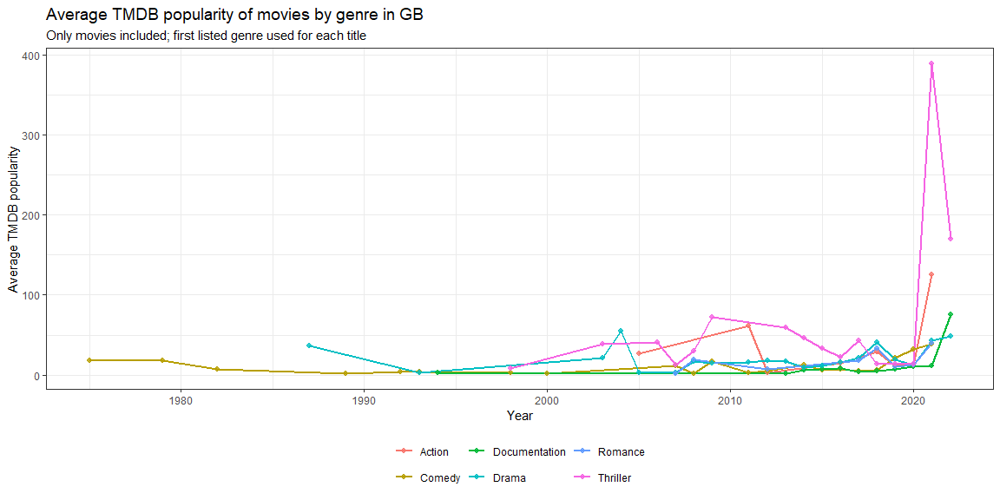

### France

As seen in the graph below, the top 6 genres for production in France
are: comedy, drama, documentation, action, crime and thriller. The
popularity of thrillers and crime has increased exponentially since
2020. Therefore, it would be a good decision to focus on streaming
thrillers and crime produced in France.

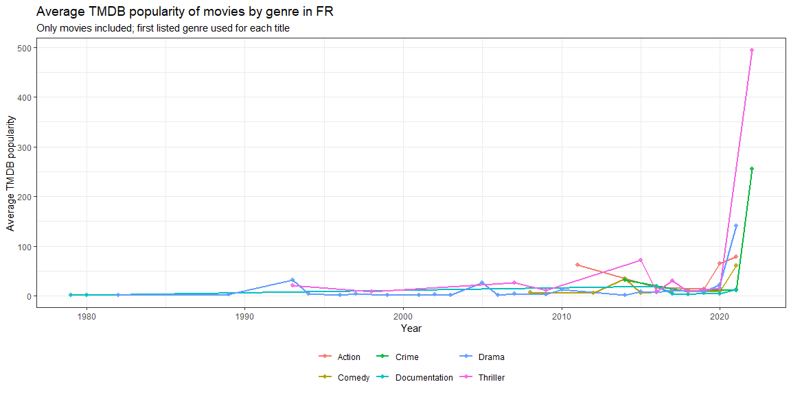

### Canada

As seen in the graph below, the top 6 genres for production in Canada
are: animation, documentation, fantasy, comedy, drama and thriller. The
popularity of fantasies, comedies and dramas have increased
exponentially since the late 2010s. Therefore, it would be a good
decision to focus on streaming fantasies, comedies and dramas produced
in Canada.

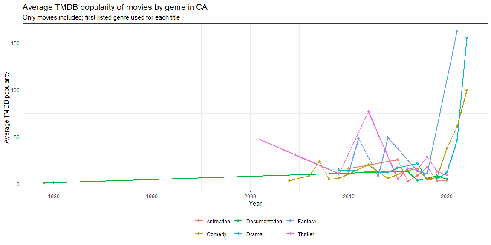

### Overall Recommendations

Therefore, my advice would be to invest in streaming the following
genres of movies produced in the following countries:

-   Drama: US
-   Thriller: France (and maybe the US as well)
-   Comedy: India
-   Action: India (and maybe Great Britain as well)
-   Documentation: France
-   Fantasy: Canada
-   Drama: Canada

I would start off being a bit cautious of streaming movies that have the
genres because there is no obvious upward trend in any of the countries
analysed:

-   Animation
-   Romance
